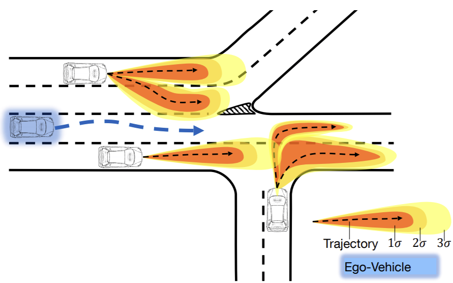

# **Generalization Analysis in Autonomous Driving Motion Prediction**
Can autonomous vehicles perform well in locations they have never been before? This work provides the answer!



# **Setup**
Um die Module und Bibliotheken einzubinden, setze das Environment mit den folgenden Befehlen auf.
Je nach computer kann die installation der requirements bei *torch* oder *pkg* versagen. 
Installiere diese Bibliotheken mit den unten gelisteten Befehlen separat.

- ```conda create --name pred_comp_env  python=3.9 -y```

- ```conda activate pred_comp_env```

- ```cat requirements.txt | xargs -n 1 pip install```

- ```pip install torch```

- ```pip install pkg```

# **Datasets**
In dieser Arbeit werden 4 Datensätze verwendet. 
Die Daten können unter den folgenden Links heruntergeladen werden:

| Datensatz    | Download                                                                         |
|--------------|----------------------------------------------------------------------------------|
| lyft level 5 | https://level-5.global/data/ -> Perception Dataset Kit -> Training dataset(58Gb) |
| nuScenes     | https://www.nuscenes.org/download -> Full dataset (v1.0) -> Metadata -> USA      |
| openDD       | https://l3pilot.eu/data/opendd -> Downloads (scroll down) -> rdb1, ..., rdb7     |
| KITTI        | https://github.com/Marchetz/MANTRA-CVPR20 -> kitti_dataset.json                  |


# **Preprocessing**
### Converter
Mit **env** und **Kitti** werden die Eingangsformate von Trajectron++ und MANTRA bezeichnet. 
Aus Gründen der Effizienz werden in dieser Arbeit nur die **env** converter verwendet. 
Für das Training von MANTRA wird geschieht eine Umwandlung von **env** zu **Kitti** bei Laufzeit.
Die Konversion der Datensätze kann durch Navigation in den Converter Ordner mit folgenden Befehle ausgeführt werden:

```cd converter/converter_main```


| Befehl                            | Beschreibung                              |
|-----------------------------------|-------------------------------------------|
| ```python nuScenes2env_main.py``` | nuScenes Datensatz ins **env** Format     |
| ```python openDD2env_main.py```   | openDD Datensatz ins **env** Format       |
| ```python lyft2env_main.py```     | lyft level 5 Datensatz ins **env** Format |
| ```python Kitti2env_main.py```    | KITTI Datensatz ins **env** Format        |

### Aufteilung nach Fahrcharakteristiken
Die Trajektorien jedes Datensatzes werden zusätzlich nach Fahrcharakteristiken aufgespaltet. 
Um dies für alle Datensätze durchzuführen, führe innerhalb des **converter_main** Ordners den folgenden Befehl aus:

| Befehl                                        | Beschreibung                                           |
|-----------------------------------------------|--------------------------------------------------------|
| ```python split_by_characteristics_main.py``` | Alle Datensatz nach **Fahrcharakteristiken** aufteilen |

# **Training: Trajectron++**
Dieser Abschnitt erläutert die einzelnen Inputs der Trainingskonfiguration von Trajectron++. 
Mit dem folgenden Befehl kommt man in den Trainings Ordner:

``` cd experiments/Trajectron/train ```

Um das Training zu starten, müssen die Argumente nach dem im folgenden beschriebenen Schema kombiniert werden.
Die **Funktion** ist für alle Experimente gleich. 
Je nach Experiment müssen die **Model Parameter** aus der untenstehenden Tabelle eingefügt werden.
Zu jeder Model _Version_ sind in der Tabelle alle **Datensätze** aufgelistet, 
auf denen das Training mit der jeweiligen Model Version durchgeführt werden soll.
Optional kann das **Data Design** angepasst werden,
die für die Experimente benötigten Hyperparameter sind jedoch schon auf _default_ eingestellt.
Zuletzt kann der Trainingsbefehl durch die für die **Anwendung** am Gerät relevanten Parameter vervollständigt werden.


| Funktion              | Model Parameter (Pflichtangabe) | Datensatz (Pflichtangabe)   | Data Design (default)                                 | Training Design (default)                           | Anwendung (default)                         |
|-----------------------|---------------------------------|-----------------------------|-------------------------------------------------------|-----------------------------------------------------|---------------------------------------------|
| ```python train.py``` | <model_parameters>              | ```--data_dir``` <data_dir> | ```--ph 12 --max_hl 4 --map_layers 'drivable_area'``` | ```--train_epochs 70 --lr 0.002 --batch_size 256``` | ```--preprocess_workers 0 --device 'cpu'``` |

#### Experiment Design
| Version                | Beschreibung                                                          | Model Parameter                                                                                                                                                                                                            | Datensatz                                                                                                                                                                                                     |
|------------------------|-----------------------------------------------------------------------|----------------------------------------------------------------------------------------------------------------------------------------------------------------------------------------------------------------------------|---------------------------------------------------------------------------------------------------------------------------------------------------------------------------------------------------------------|
| robot                  | **Basis**: Alle im Paper diskutierten Funktionalitäten                | ```--experiment_tag '' --conf '../models/original_config/robot/config.json' --map_encoding --edge_encoding --incl_robot_node --model_tag 'robot'```                                                                        | ```--data_dir openDD```, ```--data_dir nuScenes_Boston_middle```, ```--data_dir nuScenes_Queenstown_middle```, ```--data_dir nuScenes_Onenorth_middle```, ```--data_dir lyft_level_5_middle --return_robot``` |
| int_ee_me              | **Ablation** des Robot Features                                       | ```--experiment_tag ablation --conf '../models/original_config/int_ee_me/config.json' --map_encoding --edge_encoding --model_tag 'int_ee_me'```                                                                            | ```--data_dir openDD```, ```--data_dir nuScenes_Boston_middle```                                                                                                                                              |
| robot_no_map           | **Ablation** der Karte                                                | ```--experiment_tag ablation --conf '../models/original_config/robot/config.json' --edge_encoding --incl_robot_node --model_tag 'robot_no_map'```                                                                          | ```--data_dir openDD```, ```--data_dir nuScenes_Boston_middle```                                                                                                                                              |
| robot_no_edge          | **Ablation** der Interaktion                                          | ```--experiment_tag ablation --conf '../models/original_config/robot/config.json' --map_encoding --incl_robot_node --model_tag 'robot_no_edge'```                                                                          | ```--data_dir openDD```, ```--data_dir nuScenes_Boston_middle```                                                                                                                                              |
| robot, large_scale     | **Verbesserung der Generalisierung**: Datenmenge innerhalb der Domäne | ```--experiment_tag 'Verbesserung/large_scale' --num_train_samples 40000 --conf '../models/original_config/robot/config.json' --map_encoding --edge_encoding --incl_robot_node --model_tag 'robot'```                      | ```--data_dir openDD```, ```--data_dir nuScenes_Boston_middle```                                                                                                                                              |
| robot, domain_mix      | **Verbesserung der Generalisierung**: Kombination der Domänen         | ```--experiment_tag 'Verbesserung/domain_mix' --num_train_samples 20000 --percentages 0.5 0.5 --conf '../models/original_config/robot/config.json' --map_encoding --edge_encoding --incl_robot_node --model_tag 'robot'``` | ```--data_dir domain_mix```                                                                                                                                                                                   |
| robot, freq_multiplier | **Verbesserung der Generalisierung**: manipulierte Datenproportionen  | ```--experiment_tag 'Verbesserung/freq_multiplier' --node_freq_mult_train --conf '../models/original_config/robot/config.json' --map_encoding --edge_encoding --incl_robot_node --model_tag 'robot'```                     | ```--data_dir openDD```, ```--data_dir nuScenes_Boston_middle```                                                                                                                                              |

# **Training: MANTRA**
Dieser Abschnitt erläutert die einzelnen Inputs der Trainingskonfiguration von Trajectron++. 
Mit dem folgenden Befehl kommt man in den Trainings Ordner:

``` cd experiments/Mantra/train ```

Um das Training zu starten, müssen die Argumente nach dem im folgenden beschriebenen Schema kombiniert werden.
Die **Funktion** ist für alle Experimente gleich. 
Das Training besteht aus zwei Stufen. Diese müssen für jedes Model nacheinander durchlaufen werden.
Zur sauberen Zuordnung zwischen der ersten Stufe (**Autoencoder**) und der zugehörigen zweiten Stufe (**IRM** & **Decoder**),
gebe im zweiten Trainingschritt den Startzeitpunkt ```--time``` des ersten Trainingsschritts im angegebenen Format ein.
Der Zeitpunkt kann im Ordner der Modelle nachgesehen werden:

```cd experiments/Mantra/models/training_ae```

Die Zeit muss im nur im **IRM** & **Decoder** Training angegeben werden.
Folgendes Format muss dabei beachtet werden:

```--time 'YYYY-MM-DD hh:mm'```

| Funktion              | Trainingsschritt (Pflichtangabe)                            | Model Parameter (Pflichtangabe) | Datensatz (Pflichtangabe)   | Data Design (default)              | Training Design (default)                                    | Anwendung (default)                         |
|-----------------------|-------------------------------------------------------------|---------------------------------|-----------------------------|------------------------------------|--------------------------------------------------------------|---------------------------------------------|
| ```python train.py``` | ```--training_step ae```                                    | <model_parameter>               | ```--data_dir``` <data_dir> | ```--future_len 12 --past_len 4``` | ```--max_epochs 10 --learning_rate 0.0001 --batch_size 32``` | ```--preprocess_workers 0 --device 'cpu'``` |
| ```python train.py``` | ```--training_step IRM_decoder --time 'YYYY-MM-DD hh:mm'``` | <model_parameter>               | ```--data_dir``` <data_dir> | ```--future_len 12 --past_len 4``` | ```--max_epochs 30 --learning_rate 0.0002 --batch_size 32``` | ```--preprocess_workers 0 --device 'cpu'``` |

#### Experiment Design

| Version             | Beschreibung                                                          | Model Parameter                                                                                         | Datensatz                                                                                                                                                                                                               |
|---------------------|-----------------------------------------------------------------------|---------------------------------------------------------------------------------------------------------|-------------------------------------------------------------------------------------------------------------------------------------------------------------------------------------------------------------------------|
| MANTRA              | **Basis**: Alle im Paper diskutierten Funktionalitäten                | ```--experiment_tag 'MANTRA' --num_train_samples 10000```                                               | ```--data_dir openDD```, ```--data_dir nuScenes_Boston_middle```, ```--data_dir nuScenes_Queenstown_middle```, ```--data_dir nuScenes_Onenorth_middle```, ```--data_dir lyft_level_5_middle --use_robot_trajectories``` |
| MANTRA, large_scale | **Verbesserung der Generalisierung**: Datenmenge innerhalb der Domäne | ```--experiment_tag 'Verbesserung/large_scale/MANTRA' --num_train_samples 40000```                      | ```--data_dir openDD```, ```--data_dir nuScenes_Boston_middle```                                                                                                                                                        |
| MANTRA, domain_mix  | **Verbesserung der Generalisierung**: Kombination der Domänen         | ```--experiment_tag 'Verbesserung/domain_mix/MANTRA' --num_train_samples 20000 --percentages 0.5 0.5``` | ```--data_dir domain_mix```                                                                                                                                                                                             |

# **Evaluation**
Bevor die Evaluationsskripte ausgeführt werden können, muss in der Nomenklatur der Modell-Ordner das Datum entfernt werden.
Dies kann für alle Trajectron++ und MANTRA Modelle mit folgendem Befehl durchgeführt werden:

```cd experiments```

```python rename_models.py```

Führe alle hier aufgelisteten Befehle aus, um die Evaluation durchzuführen und die Ergebnisse in .json zu speichern.
Die Trajectron Befehle müssen je aus dem ```experiments/Trajectron/evaluation``` Ordner ausgeführt werden,
die MANTRA Befehle aus ```experiments/MANTRA/evaluation```

Zur Darstellung der Ergebnisse öffne das hier angegebene jupyter notebook:
```experiments/Trajectron/notebooks/evaluation.ipynb```


### **(4.1) Mess-Idiosynchrasie**
#### Trajectron++
| Beschreibung                                                                                               | Befehl                                                                                                                                                                                                                                                                                     |
|------------------------------------------------------------------------------------------------------------|--------------------------------------------------------------------------------------------------------------------------------------------------------------------------------------------------------------------------------------------------------------------------------------------|
| Generalisierung zwischen **Domänen** im selben Geschwindigkeitsbereich (mittel)                            | ```python evaluate.py --models robot/nuScenes_Boston robot/nuScenes_Queenstown robot/nuScenes_Onenorth robot/lyft_level_5 --split_criterium split_by_country_or_road_class --experiment_tag Land_und_Strassenart```                                                                        |
| Generalisierung zwischen **Geschwindigkeitsbereichen** innerhalb des selben Ortes und derselben Straßenart | ```python evaluate.py --models robot/nuScenes_Queenstown robot/nuScenes_Onenorth robot/nuScenes_Boston robot/lyft_level_5 --split_criterium split_by_speed_zone --experiment_tag Geschwindigkeitsbereich --data_dirs nuScenes_Queenstown nuScenes_Onenorth nuScenes_Boston lyft_level_5``` |

##### MANTRA
| Beschreibung                                                                                               | Befehl                                                                                                                                                                                                                                                                                      | 
|------------------------------------------------------------------------------------------------------------|---------------------------------------------------------------------------------------------------------------------------------------------------------------------------------------------------------------------------------------------------------------------------------------------|
| Generalisierung zwischen **Domänen** im selben Geschwindigkeitsbereich (mittel)                            | ```python evaluate.py --models MANTRA/nuScenes_Queenstown MANTRA/nuScenes_Onenorth MANTRA/nuScenes_Boston MANTRA/lyft_level_5 --split_criterium split_by_country_or_road_class --experiment_tag Land_und_Strassenart```                                                           |
| Generalisierung zwischen **Geschwindigkeitsbereichen** innerhalb des selben Ortes und derselben Straßenart | ```python evaluate.py  --models MANTRA/nuScenes_Queenstown MANTRA/nuScenes_Onenorth MANTRA/nuScenes_Boston MANTRA/lyft_level_5 --split_criterium split_by_speed_zone --experiment_tag Geschwindigkeitsbereich --data_dirs nuScenes_Queenstown nuScenes_Onenorth nuScenes_Boston lyft_level_5``` |

### (4.2) **Daten-Idiosynchrasie**
#### (4.2.2) In distribution Generalisierung
##### Trajectron++
| Beschreibung                                                                                                  | Befehl                                                                                                                                                                                                                                                                                                                                                |
|---------------------------------------------------------------------------------------------------------------|-------------------------------------------------------------------------------------------------------------------------------------------------------------------------------------------------------------------------------------------------------------------------------------------------------------------------------------------------------|
| **Erfassungsschwierigkeit** der Fahrcharakteristiken in den **Domänen** mit mittlerem Geschwindigkeitsbereich | ```python evaluate.py --models robot/nuScenes_Queenstown robot/nuScenes_Onenorth robot/nuScenes_Boston robot/lyft_level_5 robot/openDD --split_criterium split_by_driving_characteristics --experiment_tag in_distribution --data_dirs nuScenes_Queenstown_middle nuScenes_Onenorth_middle nuScenes_Boston_middle lyft_level_5_middle_train openDD``` |

##### MANTRA
| Beschreibung                                                                                                  | Befehl                                                                                                                                                                                                                                                                                                                                                     |
|---------------------------------------------------------------------------------------------------------------|------------------------------------------------------------------------------------------------------------------------------------------------------------------------------------------------------------------------------------------------------------------------------------------------------------------------------------------------------------|
| **Erfassungsschwierigkeit** der Fahrcharakteristiken in den **Domänen** mit mittlerem Geschwindigkeitsbereich | ```python evaluate.py --models MANTRA/nuScenes_Queenstown MANTRA/nuScenes_Onenorth MANTRA/nuScenes_Boston MANTRA/lyft_level_5 MANTRA/openDD --split_criterium split_by_driving_characteristics --experiment_tag in_distribution --data_dirs nuScenes_Queenstown_middle nuScenes_Onenorth_middle nuScenes_Boston_middle lyft_level_5_middle_train openDD``` |

#### (4.2.3) Out of Distribution Generaliserung
##### Trajectron++
| Beschreibung                                                                               | Befehl                                                                                                                                                                                                                                                                                                                                                              |  
|--------------------------------------------------------------------------------------------|---------------------------------------------------------------------------------------------------------------------------------------------------------------------------------------------------------------------------------------------------------------------------------------------------------------------------------------------------------------------|
| Out of Distribution Generalisierung zwischen **nuScenes-Boston** und **nuScenes-Onenorth** | ```python evaluate.py --models robot/nuScenes_Boston robot/nuScenes_Onenorth robot/nuScenes_Boston robot/nuScenes_Onenorth --split_criterium split_by_driving_characteristics --experiment_tag out_of_distribution/nuScenes_Boston_nuScenes_Onenorth --data_dirs nuScenes_Boston_middle nuScenes_Boston_middle nuScenes_Onenorth_middle nuScenes_Onenorth_middle``` |
| Out of Distribution Generalisierung zwischen **nuScenes-Boston** und **lyft level 5**      | ```python evaluate.py --models robot/nuScenes_Boston robot/lyft_level_5 robot/nuScenes_Boston robot/lyft_level_5 --split_criterium split_by_driving_characteristics --experiment_tag out_of_distribution/nuScenes_Boston_lyft_level_5 --data_dirs nuScenes_Boston_middle nuScenes_Boston_middle lyft_level_5_middle_train lyft_level_5_middle_train```              |                                       
| Out of Distribution Generalisierung zwischen **nuScenes-Boston** und **openDD**            | ```python evaluate.py --models robot/nuScenes_Boston robot/openDD robot/nuScenes_Boston robot/openDD --split_criterium split_by_driving_characteristics --experiment_tag out_of_distribution/nuScenes_Boston_openDD --data_dirs nuScenes_Boston_middle nuScenes_Boston_middle openDD openDD```                                                                      | 

##### MANTRA
| Beschreibung                                                                               | Befehl                                                                                                                                                                                                                                                                                                                                                                  |
|--------------------------------------------------------------------------------------------|-------------------------------------------------------------------------------------------------------------------------------------------------------------------------------------------------------------------------------------------------------------------------------------------------------------------------------------------------------------------------|
| Out of Distribution Generalisierung zwischen **nuScenes-Boston** und **nuScenes-Onenorth** | ```python evaluate.py --models MANTRA/nuScenes_Boston MANTRA/nuScenes_Onenorth MANTRA/nuScenes_Boston MANTRA/nuScenes_Onenorth --split_criterium split_by_driving_characteristics --experiment_tag out_of_distribution/nuScenes_Boston_nuScenes_Onenorth --data_dirs nuScenes_Boston_middle nuScenes_Boston_middle nuScenes_Onenorth_middle nuScenes_Onenorth_middle``` |                                       
| Out of Distribution Generalisierung zwischen **nuScenes-Boston** und **lyft level 5**      | ```python evaluate.py --models MANTRA/nuScenes_Boston MANTRA/lyft_level_5 MANTRA/nuScenes_Boston MANTRA/lyft_level_5 --split_criterium split_by_driving_characteristics --experiment_tag out_of_distribution/nuScenes_Boston_lyft_level_5 --data_dirs nuScenes_Boston_middle nuScenes_Boston_middle lyft_level_5_middle_train lyft_level_5_middle_train```                                       |                                       
| Out of Distribution Generalisierung zwischen **nuScenes-Boston** und **openDD**            | ```python evaluate.py --models MANTRA/nuScenes_Boston MANTRA/openDD MANTRA/nuScenes_Boston MANTRA/openDD --split_criterium split_by_driving_characteristics --experiment_tag out_of_distribution/nuScenes_Boston_openDD --data_dirs nuScenes_Boston_middle nuScenes_Boston_middle openDD openDD```                                                                      |                                       


### **(4.3) Ablationsstudie**
#### Trajectron++
| Beschreibung                          | Befehl                                                                                                                                                                                                                                                                                                                                         |
|---------------------------------------|------------------------------------------------------------------------------------------------------------------------------------------------------------------------------------------------------------------------------------------------------------------------------------------------------------------------------------------------|
| Ablation der **Karteninformation**    | ```python evaluate.py --models robot/nuScenes_Boston ablation/robot_no_map/nuScenes_Boston robot/openDD ablation/robot_no_map/openDD --split_criterium split_by_standing_status --experiment_tag ablation/robot_no_map --data_dirs nuScenes_Queenstown_middle nuScenes_Onenorth_middle nuScenes_Boston_middle lyft_level_5_middle_train openDD```    |                                       
| Ablation der **Robot Funktionalität** | ```python evaluate.py --models robot/nuScenes_Boston ablation/int_ee_me/nuScenes_Boston robot/openDD ablation/int_ee_me/openDD --split_criterium split_by_standing_status --experiment_tag ablation/int_ee_me --data_dirs nuScenes_Queenstown_middle nuScenes_Onenorth_middle nuScenes_Boston_middle lyft_level_5_middle_train openDD```             |                                       
| Ablation der **Interaktion**          | ```python evaluate.py --models robot/nuScenes_Boston ablation/robot_no_edge/nuScenes_Boston robot/openDD ablation/robot_no_edge/openDD --split_criterium split_by_standing_status --experiment_tag ablation/robot_no_edge --data_dirs nuScenes_Queenstown_middle nuScenes_Onenorth_middle nuScenes_Boston_middle lyft_level_5_middle_train openDD``` |                                       

#### MANTRA
| Beschreibung                                     | Befehl                                                                                                                                                                                                                                                                                                                                                                       |
|--------------------------------------------------|------------------------------------------------------------------------------------------------------------------------------------------------------------------------------------------------------------------------------------------------------------------------------------------------------------------------------------------------------------------------------|
| Ablation der **Karteninformation**               | ```python evaluate.py --models MANTRA/nuScenes_Boston MANTRA/nuScenes_Boston MANTRA/openDD MANTRA/openDD --use_map True False True False --split_criterium split_by_standing_status --experiment_tag ablation/no_map --data_dirs nuScenes_Queenstown_middle nuScenes_Onenorth_middle nuScenes_Boston_middle lyft_level_5_middle_train openDD```                              |                                      
| Hinzufügen der **Online Writing Funktionalität** | ```python evaluate.py --models MANTRA/nuScenes_Boston MANTRA/nuScenes_Boston MANTRA/openDD MANTRA/openDD --write False True False True --num_eval_samples 400 --split_criterium split_by_standing_status --experiment_tag ablation/online_writing --data_dirs nuScenes_Queenstown_middle nuScenes_Onenorth_middle nuScenes_Boston_middle lyft_level_5_middle_train openDD``` |                                      


### **(4.4) Verbesserung der Generalisierung**
#### Trajectron++
| Beschreibung                               | Befehl                                                                                                                                                                                                                                                                                                                                                                          |
|--------------------------------------------|---------------------------------------------------------------------------------------------------------------------------------------------------------------------------------------------------------------------------------------------------------------------------------------------------------------------------------------------------------------------------------|
| Erhöhung der Datenmenge auf **Mikroebene** | ```python evaluate.py --models robot/nuScenes_Boston Verbesserung/large_scale/robot/nuScenes_Boston robot/openDD Verbesserung/large_scale/robot/openDD --split_criterium split_by_standing_status --experiment_tag Verbesserung/large_scale --data_dirs nuScenes_Queenstown_middle nuScenes_Onenorth_middle nuScenes_Boston_middle lyft_level_5_middle_train openDD```          |                                     
| Erhöhung der Datenmenge auf **Makroebene** | ```python evaluate.py --models robot/nuScenes_Boston Verbesserung/domain_mix/robot/domain_mix robot/openDD Verbesserung/domain_mix/robot/domain_mix --split_criterium split_by_standing_status --experiment_tag Verbesserung/domain_mix --data_dirs nuScenes_Queenstown_middle nuScenes_Onenorth_middle nuScenes_Boston_middle lyft_level_5_middle_train openDD```              |                                     
| Manipulation der **Datenproportionen**     | ```python evaluate.py --models robot/nuScenes_Boston Verbesserung/freq_multiplier/robot/nuScenes_Boston robot/openDD Verbesserung/freq_multiplier/robot/openDD --split_criterium split_by_standing_status --experiment_tag Verbesserung/freq_multiplier --data_dirs nuScenes_Queenstown_middle nuScenes_Onenorth_middle nuScenes_Boston_middle lyft_level_5_middle_train openDD``` |                                     


#### MANTRA
| Beschreibung                               | Befehl                                                                                                                                                                                                                                                                                                                                                                  |
|--------------------------------------------|-------------------------------------------------------------------------------------------------------------------------------------------------------------------------------------------------------------------------------------------------------------------------------------------------------------------------------------------------------------------------|
| Erhöhung der Datenmenge auf **Mikroebene** | ```python evaluate.py --models MANTRA/nuScenes_Boston Verbesserung/large_scale/MANTRA/nuScenes_Boston MANTRA/openDD Verbesserung/large_scale/MANTRA/openDD --split_criterium split_by_standing_status --experiment_tag Verbesserung/large_scale --data_dirs nuScenes_Queenstown_middle nuScenes_Onenorth_middle nuScenes_Boston_middle lyft_level_5_middle_train openDD``` |                                       
| Erhöhung der Datenmenge auf **Makroebene** | ```python evaluate.py --models MANTRA/nuScenes_Boston Verbesserung/domain_mix/MANTRA/domain_mix MANTRA/openDD Verbesserung/domain_mix/MANTRA/domain_mix --split_criterium split_by_standing_status --experiment_tag Verbesserung/domain_mix --data_dirs nuScenes_Queenstown_middle nuScenes_Onenorth_middle nuScenes_Boston_middle lyft_level_5_middle_train openDD```  |                                       


# **Visualisierung**
Zur Visualisierung der Prädiktionen von Trajectron++ öffne das folgende jupyter notebook und folge dem Dialog

```experiments/Trajectron/visualization/visualization.ipynb```

Zur Visualisierung der Prädiktionen von MANTRA öffne das folgende jupyter notebook und folge dem Dialog

```experiments/MANTRA/visualization/visualization.ipynb```